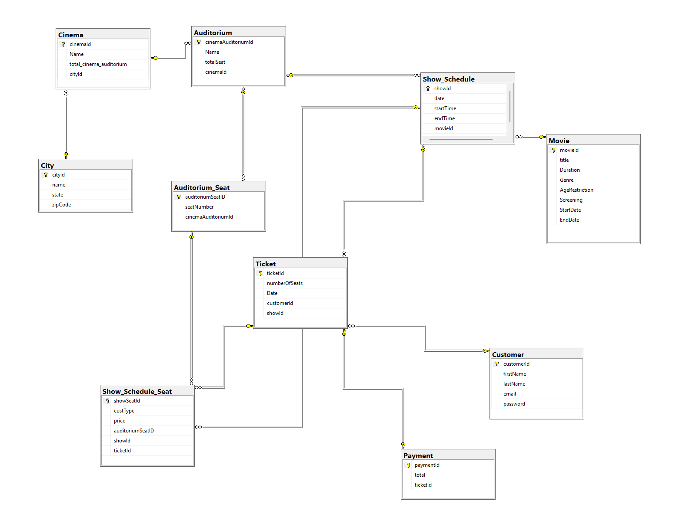

# Cineworld Ticket Buying App - Database Assignment

<sub> ✅ This project was developed as part of my Data Analysis coursework at Fontys ICT & Business during the second semester of the first year.  </sub>  

## 📌 Project Overview
This repository is designed for the "Cineworld Ticket Buying App," a university project that enables users to purchase movie tickets and select seats through an interactive interface. The project aims to model a real-world database that supports a cinema ticketing system.

## 🧱 Database Structure
Here is the database structure used in this project:



## 🛠 Technologies Used
This project utilizes the following technologies:

- SQL – Database creation and management
- Microsoft SQL Server Management Studio – Database environment

## 🏗️ Project Structure 

Below is the file structure for this project:

```plaintext
📂 cineworld-ticket-app
│
├─ 📄 README.md                  # Project documentation
│
├─ 📄 tables-script.txt          # SQL script for creating tables
├─ 📄 insert-data-script.txt     # SQL script for inserting initial data
├─ 📄 queries-for-testing-database.txt # SQL script for testing and example queries
│
└─ 📁 images
   └─ 📄 database-structure.png  # Image showing the database structure
```

## 📝 Reflection
This project was a practical exercise in designing and implementing a relational database with realistic data and queries. Challenges included designing a schema that supports complex queries and ensures data integrity through proper use of keys and constraints.
